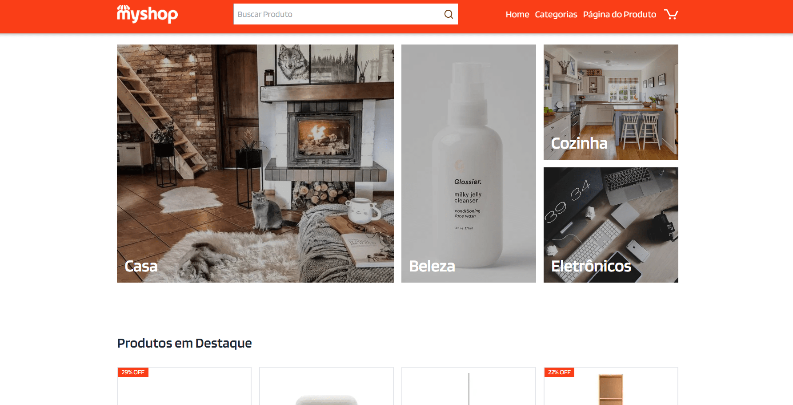
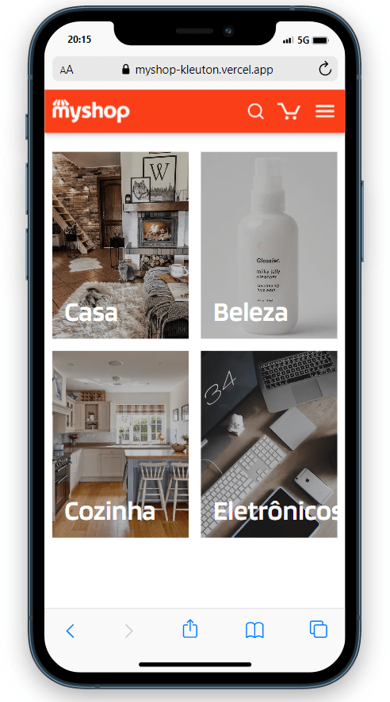

<h1 align='center'> MyShop - E-commerce Minimalista </h1>

 

>📃 Bem-vindo(a) ao MyShop, o projeto de E-commerce desenvolvido pelo Analista de Sistemas - Kleuton Novais. Com foco exclusivo nos produtos oferece uma experiência única e minimalista para a melhor usabilidade ao usuário, o MyShop foi desenvolvido com a mais atual tecnologia, feito como Next.js na versão 13.4.10, TypeScript, Tailwind e uma API fake para o backend dos produtos.

Com um design limpo e elegante, nosso objetivo é colocar os produtos em destaque, permitindo que você se concentre no que realmente importa: encontrar os itens que deseja. Vamos dar uma olhada em algumas das principais características que tornam o MyShop uma escolha excepcional para suas compras online...

 

[😀=> MyShop <=😀](https://myshop-kleuton.vercel.app/)

 

<h3> Recursos Principais </h3>

- Conexão Gateway de Pagamento Strapi: MyShop conta com uma integração poderosa com a API Strapi para facilitar os processos de pagamento. A API Strapi é uma solução robusta que oferece um ambiente seguro para gerenciar transações financeiras, garantindo uma experiência suave e confiável para nossos clientes.

- Rotas e Navegação: O MyShop utiliza o poder do Next.js para criar um sistema de roteamento eficiente. Isso permite uma transição perfeita entre as diferentes páginas, garantindo uma experiência de navegação fluida e rápida.

- Estados e Contextos com Hooks: Aproveitamos a flexibilidade do React (useState, useContext) para gerenciar o estado dos componentes com Hooks. Isso possibilita uma atualização dinâmica da interface conforme você interage com os produtos e o carrinho de compras.

- Página Inicial Atraente: Ao acessar a página inicial do MyShop, você será recebido(a) com uma imagem cativante, destacando as principais categorias de produtos disponíveis. É uma forma de apresentar uma visão geral do que temos a oferecer e facilitar a localização dos itens que você procura.

- Banners e Carrossel de Produtos em Tendência: Mantenha-se atualizado(a) com os produtos mais populares do momento, apresentados em banners e um carrossel de produtos em tendência na página inicial.
Página de Categorias: Se você deseja explorar todas as categorias disponíveis, nossa página dedicada às categorias permite uma visão detalhada de todas as opções, facilitando sua escolha.

- Página de Produtos: Ao clicar em um produto específico, você será direcionado(a) para sua página exclusiva. Lá, você encontrará fotos e todos os detalhes do produto, juntamente com botões de ação para compra e adição ao carrinho.

- Carrinho de Compras Inteligente: Nosso sistema de carrinho de compras é projetado para simplificar o processo de compra. Usando um modal interativo, você pode visualizar e gerenciar os produtos no seu carrinho antes de finalizar a compra. Uso do LocalStorage para tornar a experiência do usuário ainda mais fluida. Isso permite que o usuário retome suas compras facilmente, mesmo que saia e volte mais tarde.

 

<h2> 🛠 Tecnologias Utilizadas </h2>

>Este projeto foi desenvolvido com as seguintes tecnologias:

- ReactJS
- Next.js
- Tailwind CSS
- TypeScript

<h3> 🛠 Bibliotecas e Ferramentas Adicionais </h3>

>Além das tecnologias principais, foram utilizadas as seguintes bibliotecas e ferramentas:

- Stripe
- ESLint
- Tailwind Variants

 

<h3> Como Usar </h3>

>Para utilizar o My-Shop em sua máquina local, siga as instruções abaixo:

- Clone este repositório:
- Instale as dependências: npm install ou yarn install
- Inicie o servidor de desenvolvimento: npm run dev ou yarn dev
- Acesse o aplicativo em seu navegador em: http://localhost:3000

 

<h3> Autor </h3>

> Kleuton Novais

<h2 align='center'> Meus contatos </h2>

>Se tiver alguma dúvida, sugestão ou feedback, sinta-se à vontade para entrar em contato:

* [LinkedIn](https://www.linkedin.com/in/kleuton-novais/)

* [PORTIFOLIO](https://kleuton.dev)

 

<h3> Licença </h3>

